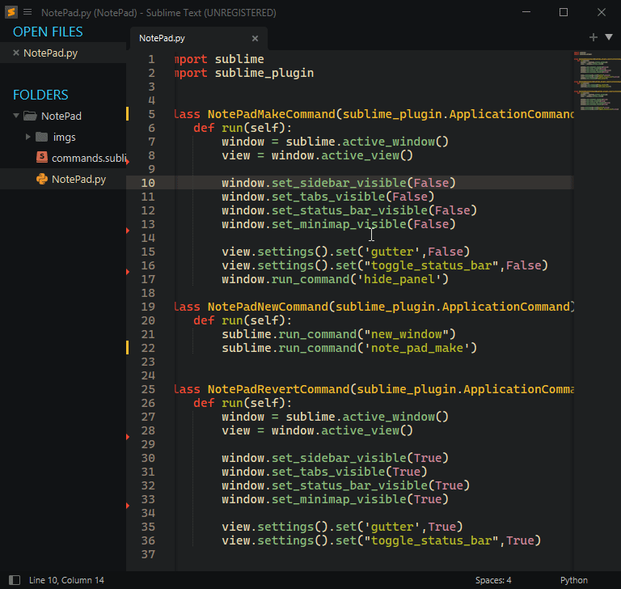

# Temporarily hide every component of sublime text for full focus or just simplicity  

Hide tabs, minimap, gutter, status bar, sidebar, panel with open command.  
No worries, there is a Revert command too if you are not a st pro :)

NotePad will turn the Sublime Text into a plain notepad.
I wanted a notepad with sublime functionality, but there wasn't any, so I had to make one. 
***Enjoy*** **<3**

## Commands  

- **New NotePad**
	Open NotePad in new window  

- **Make NotePad**
	Make the window a NotePad

- **Revert NotePad**
	Revert from NotePad settings